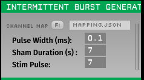

# Intermittent burst generator plugin
<p align="center">
  
</p>
<p align="center"><i>Intermittent burst generator plugin</i></p>

The **Intermittent Burst Generator** plugin is designed to send stimulation events on a specified event channel for a certain number of pulses. After this burst of stimulation, it will enter a "Sham Duration" phase, where no stimulation pulses are sent. This cycle of stimulation and sham duration can be customized based on the user’s requirements.
This plugin can serve the purpose of alternating between stimulation trains and inter-train intervals, as in intermittent burst stimulation. 
> **_However, please note:_**
> 
> **_The plugin does not generate continuous stimulation signals. Instead, it produces stimulation signals based on specific events, such as the crossing of a certain phase, from the event occured in crossing detector. The stimulation occurs when the specified event or condition is met, not continuously._**
> 
> **_Additionally, the event aligns perfectly with the original events, ensuring no delays occur._**

## Parameters:
- **STIM IN & OUT**  
  The **STIM IN** textbox corresponds to the event channel where the stimulation event is being received.  
  The **OUT** textbox corresponds to the event channel where the stimulation event needs to be sent.

- **SHAM IN & OUT**  
  The **SHAM IN** textbox corresponds to the event channel where the sham event is being received.  
  The **OUT** textbox corresponds to the event channel where the sham event needs to be sent.

- **Pulse Width (ms):**  
  Specifies the duration (in milliseconds) of each pulse triggered by the Intermittent Burst Generator. This pulse is sent through the channels specified in the JSON configuration file.

- **Sham Duration (s):**  
  Defines how long (in seconds) the sham pulses or events are sent. This value controls the duration of the sham period.

- **Stim Pulse:**  
  Specifies the number of stimulation pulses that must occur before the next sham period is activated. It determines how many stimulation pulses happen before a new sham event is triggered.


## Building the plugins
Building the plugins requires [CMake](https://cmake.org/). Detailed instructions on how to build open ephys plugins with CMake can be found in [our wiki](https://open-ephys.atlassian.net/wiki/spaces/OEW/pages/1259110401/Plugin+CMake+Builds).

## Installation

If you are building this plugin outside the `oep-installation` installation, follow these steps:

1. **Navigate to the `intermittent-burst-generator` folder**  
   This folder should be located next to the `Source` and `Build` folders.

2. **Open Git Bash**  
   Launch Git Bash or your preferred terminal.

3. **Create a `.gitignore` file**  
   Run the following command to create a `.gitignore` file:
   ```bash
   touch .gitignore
	```
	
4. **Navigate to the `Build` directory**
   ```bash
   cd Build
   ```
   Run the following command to create a `.gitignore` file:
   ```bash
   touch .gitignore
   ```
6. **Generate the project for your version**
	Run the following command to generate the Visual Studio project:
  
  ```bash
	cmake -G "Visual Studio 17 2022" -A x64 ..
  ```
7. **Build the project in Release mode**
	Run the following command to compile and build the Release version of the plugin:
  
  ```bash
	cmake --build . --config Release
  ```
8. **Install the plugin (copy DLLs to the correct folder)**
	To install the plugin and copy the generated DLLs to the appropriate folder, run:
  
  ```bash
	cmake --install . --config Release
  ```
## Developer's Note:
Developed by: Sumedh Sopan Nagrale (nagra007@umn.edu)

Currently Maintained by: Sumedh Sopan Nagrale (nagra007@umn.edu)
