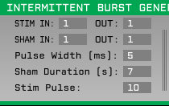

# Parallel port output plugin
Intermittent burst generator is a plugin that sends event on the specified event channel for specified number of pulses, and then sends no stim pulses during Sham Duration.

### Parameters

* Pulse Width (ms): Pulse width in millisecond for the event that will be triggered out of Intermittent burst generator on the channels specified by the json file.
* Sham Duration (s): The duration for which the sham pulses are sent or event is sent, for "sham duration" seconds.
* Stim Pulse: Number of stimulation pulses we have to wait till the next sham duration is turned on.

### Note
The json format is as follow 
Example: IN:OUT
{
1:1,
2:2
}
where IN in the input event channel and OUT is the output event channel.

### Building the plugins
Building the plugins requires [CMake](https://cmake.org/). Detailed instructions on how to build open ephys plugins with CMake can be found in [our wiki](https://open-ephys.atlassian.net/wiki/spaces/OEW/pages/1259110401/Plugin+CMake+Builds).